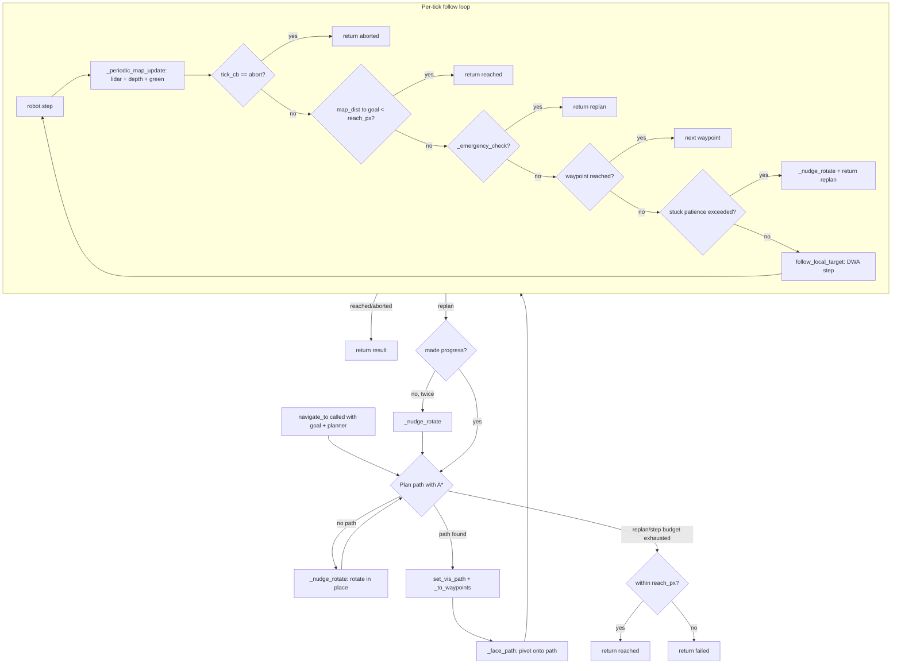

# `navigation.py` — Detailed Explanation

This document explains **everything** the navigation layer does in this project.
If you read only this file, you should understand how the robot turns an A\*
grid path into safe, single‑threaded motion — including how it maps as it
drives, how it avoids obstacles and green hazards, how it decides it has
arrived, and how it recovers **without ever driving in reverse**.

---

## 1. Where navigation sits in the system

The controller is split into single‑responsibility layers:

| Layer | File | Responsibility |
|-------|------|----------------|
| Hardware / pose / motion | `my_robot.py` | Devices, odometry, coordinate conversions, motor primitives, DWA step, lidar→grid |
| Perception | `perception.py` | Cameras + lidar interpretation (pillars, green, obstacle distances, depth obstacles) |
| **Navigation** | **`navigation.py`** | **Plan → follow → replan control loop, reactive safety, recovery** |
| Mission (state machine) | `mission.py` | Explore → localise both pillars → traverse blue → yellow |
| Planning | `map.py` (`GridMap`) + `astar_2_spline.py` | Occupancy grid + A\* path search |

The `Navigator` is the **executor**: the mission decides *where* to go (a goal
cell + which planner to use); the navigator makes the robot actually get there
safely, and reports back `'reached'`, `'aborted'`, or `'failed'`.

### Key design principle: single thread
Everything happens on the one thread that calls `robot.step()`. The navigator
never spawns threads and never touches Webots devices from anywhere except the
main loop. This is deliberate — the Webots controller API is **not**
thread‑safe, and the original project failed because background threads drove
the motors and stepped the simulation concurrently.

---

## 2. Module docstring & imports

The module docstring states the navigator’s job: it drives the robot toward a
map‑cell goal using an externally supplied A\* planner while continuously:

- updating the occupancy grid from the lidar (so unseen walls are mapped
  **before** a collision can happen),
- emergency‑stopping when a sensor reports an obstacle inside the safety
  envelope (protecting the encoder odometry from collision slip),
- braking for green (Poison) ground,
- calling a per‑tick mission callback (used to scan for pillars).

### Constants imported (from `CONSTANTS.py`)

| Constant | Meaning |
|----------|---------|
| `NAV_WAYPOINT_STRIDE` | Sample every Nth path point as a waypoint |
| `NAV_WAYPOINT_REACH_PX` | Pixel distance at which a waypoint counts as reached |
| `NAV_GOAL_REACH_PX` | Default pixel tolerance for the final goal |
| `NAV_MAX_REPLANS` | Max plan/replan attempts per goal |
| `NAV_MAX_STEPS_PER_GOAL` | Hard cap on control steps per goal (prevents infinite loops) |
| `NAV_MAP_UPDATE_EVERY` | Tick throttle: only *consider* a map update every Nth control step |
| `NAV_MAP_UPDATE_MIN_DIST_M` | Only fold a scan into the map after the robot has travelled at least this far since the last update (stable-distance gate) |
| `NAV_STUCK_DIST_M` | Movement (m) below which the robot is “not progressing” |
| `NAV_STUCK_PATIENCE` | Ticks without progress before declaring stuck |
| `SAFE_STOP_DIST_M` | Emergency‑stop distance from the lidar front cone |
| `SAFE_RANGE_STOP_M` | Emergency‑stop distance from the front range sensors |
| `SAFE_FRONT_CONE_DEG` | Half‑angle of the lidar front safety cone |
| `EMERGENCY_BACKUP_MS` | Duration of the optional backup nudge |
| `GREEN_MARK_MIN_POINTS` | Min projected points before stamping green on the map |
| `DEPTH_FRONT_STOP_M` | Emergency‑stop distance for depth‑detected obstacles ahead |
| `RECOVERY_ALLOW_REVERSE` | If `False` (default) the robot never reverses |
| `NUDGE_ROTATE_DEG` | In‑place rotation used to break deadlocks |
| `FACE_TARGET_ANGLE_TOL_RAD` | Heading tolerance when pivoting onto a new path |

`numpy` is imported for vector math (distances, headings).

---

## 3. The `Navigator` class

### `__init__(self, robot, perception)`
Stores two dependencies:
- `self.robot` — the `MyRobot` instance (pose, motion, map object, lidar).
- `self.perception` — the `Perception` instance (obstacle distances, green
  detection, depth‑obstacle projection).

The navigator holds **no mutable navigation state** between calls; each
`navigate_to` call is self‑contained. This keeps behaviour predictable.

---

## 4. Public API — `navigate_to(...)`

```python
navigate_to(goal_map, planner, reach_px=NAV_GOAL_REACH_PX,
            tick_cb=None, allow_green_avoid=True,
            max_steps=NAV_MAX_STEPS_PER_GOAL) -> 'reached' | 'aborted' | 'failed'
```

This is the **only method the mission calls**. It implements the outer
**plan → follow → replan** loop.

**Parameters**
- `goal_map` — target cell `(x, y)` in grid coordinates.
- `planner` — a callable `(start_cell, goal_cell) -> path`. The mission passes
  either `GridMap.find_path` (point‑to‑point) or `GridMap.find_path_for_frontier`
  (exploration). Decoupling the planner keeps the navigator planner‑agnostic.
- `reach_px` — how close (in pixels) the robot cell must get to the goal cell
  to count as arrived. For pillars the mission passes `COLUMN_REACH_PX = 2`.
- `tick_cb` — optional function called once per control tick. If it returns the
  string `'abort'`, navigation stops early and returns `'aborted'`. The mission
  uses this to keep scanning for pillars while driving.
- `allow_green_avoid` — when `True`, green ground triggers avoidance/braking.
- `max_steps` — hard cap on total control steps, so a single goal can never
  loop forever.

**Algorithm (step by step)**
1. Initialise `steps_used = 0`, remember `last_progress` position, and a
   `stagnant` counter.
2. Loop up to `NAV_MAX_REPLANS` times:
   1. Read the robot’s current cell as the plan `start`.
   2. Call `planner(start, goal)`.
   3. **If no path** (`None`, empty, or length < 2): the robot is boxed in or
      the goal is currently unreachable → call `_nudge_rotate()` to rotate in
      place (change viewpoint, expose new free space) and `continue` to replan.
      If `_nudge_rotate()` reports simulation end, return `'failed'`.
   4. Publish the path for the visualiser (`robot.set_vis_path`).
   5. Down‑sample the dense path into sparse `waypoints` (`_to_waypoints`).
   6. **Face the path** (`_face_path`) — pivot in place toward the first real
      waypoint so the robot turns *onto* the path instead of creeping forward
      into a wall while turning.
   7. Follow the waypoints (`_follow_waypoints`), which returns a `result` and
      the number of `used` steps. Accumulate `steps_used`.
   8. If `result` is `'reached'` or `'aborted'`, return it immediately.
   9. If the step budget is exhausted, break out.
   10. Otherwise `result == 'replan'`: check progress. If the robot has moved
       less than 0.10 m since the last progress checkpoint, increment
       `stagnant`; after 2 stagnant replans, `_nudge_rotate()` to break the
       deadlock (still **no reverse**). If it did move, reset `stagnant` and
       update `last_progress`.
3. After the loop, do a final tolerance check: if the robot is already within
   `reach_px` of the goal, return `'reached'`; otherwise `'failed'`.

**Return values**
- `'reached'` — robot cell is within `reach_px` of `goal_map`.
- `'aborted'` — the `tick_cb` requested an early stop (e.g. mission decided it
  had localised both pillars).
- `'failed'` — no achievable path, or the step/replan budget ran out.

**Why replanning instead of reversing:** when the follow loop hits an obstacle
it returns `'replan'`; because the obstacle was just written into the map, the
next `planner(...)` call routes *around* it. This is the core of the
requirement “if the path is not OK, replan” rather than blindly reversing.

---

## 5. Inner follow loop — `_follow_waypoints(...)`

```python
_follow_waypoints(waypoints, goal_map, reach_px, tick_cb,
                  allow_green_avoid, step_budget) -> (result, steps_used)
```

Drives the robot along one waypoint list. `result` is one of `'reached'`,
`'aborted'`, `'replan'`, or `'failed'`.

**State it tracks**
- `steps` — control ticks consumed (bounded by `step_budget`).
- `stuck_ticks` — consecutive ticks with no real progress.
- `last_pos` — the last position at which the robot had progressed.

**Per‑waypoint, per‑tick sequence** (for each waypoint, loop while within budget):
1. `robot.step()` — advance the simulation one timestep (also refreshes
   odometry). If it returns `-1` (Webots quitting), return `('failed', steps)`.
2. `_periodic_map_update(steps)` — fold lidar + depth + green into the grid on
   the configured cadence (see §7).
3. `robot.update_vis()` — publish the robot’s cell to the visualiser.
4. **Mission callback**: if `tick_cb()` returns `'abort'`, stop the motors and
   return `('aborted', steps)`.
5. **Goal reached?** If `get_map_distance(goal_map) < reach_px`, stop and return
   `('reached', steps)`. *(This is the map‑coordinate arrival test — the lidar
   is not used to decide arrival.)*
6. **Emergency?** If `_emergency_check(...)` is `True`, return
   `('replan', steps)` so the outer loop replans around the newly‑mapped
   obstacle.
7. **Waypoint reached?** If within `NAV_WAYPOINT_REACH_PX` of the current
   waypoint, `break` to advance to the next waypoint.
8. **Stuck monitor** (the *only* stuck detector): if the robot has moved less
   than `NAV_STUCK_DIST_M` since `last_pos`, increment `stuck_ticks`; once it
   reaches `NAV_STUCK_PATIENCE`, stop, `_nudge_rotate()` (no reverse) and return
   `('replan', steps)`. If it *did* move, reset `stuck_ticks` and update
   `last_pos`.
9. **Drive**: `robot.follow_local_target(wp)` performs one DWA control step
   toward the waypoint (sets wheel velocities). Its `is_stuck` flag is
   intentionally always `False` (real stuck detection is the monitor in step 8),
   but the branch is kept defensively — if it were ever `True`, the navigator
   rotates and replans.
10. When all waypoints are consumed, do a final reach check; return
    `('reached', steps)` if close enough, else `('replan', steps)`.

**Important subtlety (documented in the code):** the stuck monitor accumulates
over many ticks (distance since the robot *last actually advanced*), rather than
comparing two consecutive 32 ms ticks. A robot cannot move `NAV_STUCK_DIST_M`
(5 cm) in a single timestep, so a per‑tick check would trip on every call — that
exact bug previously caused the robot to reverse and replan every tick and never
follow the path.

---

## 6. Reactive safety — `_emergency_check(allow_green_avoid)`

Returns `True` when an obstacle or green hazard is imminent (caller should
replan), else `False`. This is what prevents collisions from corrupting the
encoder‑based odometry.

**Checks performed, in order:**
1. **Green (Poison) ground ahead** (only if `allow_green_avoid`): if
   `perception.green_close_ahead()` is `True`, stop, stamp the green area onto
   the map (`_stamp_green`), optionally reverse a hair (disabled by default),
   and return `True`. The robot must never drive onto green.
2. **Obstacle inside the envelope**: compute three independent distances —
   - `front` = `perception.lidar_front_min_dist(SAFE_FRONT_CONE_DEG)` (2D lidar
     front cone),
   - `range_hit` = front range sensors `ds[0]` (front‑left) / `ds[2]`
     (front‑right) below `SAFE_RANGE_STOP_M`,
   - `depth_front` = `perception.depth_front_min_dist()` (depth camera; catches
     **flat‑on‑floor and floating walls** the horizontal lidar misses).

   If `front < SAFE_STOP_DIST_M` **or** `range_hit` **or**
   `depth_front < DEPTH_FRONT_STOP_M`, stop, stamp the depth obstacles onto the
   map (`_stamp_depth`), optionally reverse (disabled by default), and return
   `True`.

**Design decision — no reverse, no `CLOSED` stamp:** the obstacle is already
recorded in the occupancy grid by the map update, so the navigator simply stops
and lets the caller replan around it. It deliberately does **not** stamp a big
`CLOSED` rectangle (which could seal a legitimate narrow passage) and does
**not** drive backward as an avoidance strategy.

---

## 7. Map maintenance while driving

### `_stamp_green(self)`
Projects currently‑visible green ground to map cells
(`perception.green_ground_map_points()`) and, if there are at least
`GREEN_MARK_MIN_POINTS` of them, marks those cells lethal via
`robot.mark_green_cells(...)`. Wrapped in `try/except` so a projection error can
never crash navigation.

### `_stamp_depth(self)`
Gets `(ground, floating)` obstacle cells from
`perception.depth_obstacle_points()` and writes them into the grid via
`robot.map_object.mark_depth_obstacles(...)`:
- **ground** cells → normal `OBSTACLE` (walls lying flat on the floor / low
  walls the lidar beam passes over),
- **floating** cells → the distinct `FLOATING_WALL` value (elevated walls with a
  gap beneath them), which is drawn in a separate colour so it is visible when
  testing.

Also wrapped in `try/except`.

### `_periodic_map_update(self, step_i)`
Called every tick from the follow loop, it folds lidar + depth + green into the
grid **only after the robot has moved a small, stable distance** — not on a
fixed tick cadence. It applies three gates, cheapest first:
1. **Tick throttle** — do nothing unless `step_i % NAV_MAP_UPDATE_EVERY == 0`
   (avoids running the checks every single tick).
2. **Motion sanity** — skip while the robot `is_turning()` or is not
   `robot_on_ground()` (a spinning/tilted platform produces distorted scans).
3. **Stable‑distance gate** — require at least `NAV_MAP_UPDATE_MIN_DIST_M` of
   travel since the previous update (tracked via `self._last_map_update_pos`).

Why the distance gate: updating the map continuously while the robot maneuvers —
especially wiggling/creeping through **narrow maze passages** — captures
unstable/false readings and injects significant noise into the map, which
degrades planning and makes tight passages hard to traverse. Waiting for a small
stable displacement lets readings settle before they are incorporated. When all
gates pass it:
1. `robot.lidar_update_map()` — fold the (range‑gated) lidar scan into the grid,
2. `_stamp_green()` — mark visible green,
3. `_stamp_depth()` — mark flat/floating walls,

and records the current position as `self._last_map_update_pos`.

This gated mapping still lets the robot see walls **before** it can hit them
(the reactive brake in `_emergency_check` reads perception directly and does not
depend on this cadence), while keeping the map clean.

---

## 8. Recovery — rotate, never reverse

### `_optional_reverse(self)`
Performs a tiny `robot.move_backward_milisecond(EMERGENCY_BACKUP_MS)` **only if**
`RECOVERY_ALLOW_REVERSE` is `True`. It is `False` by default, so this is a
no‑op — the robot never uses reverse as an obstacle‑avoidance strategy. It
exists as an explicit, opt‑in escape hatch for genuinely wedged situations.

### `_nudge_rotate(self)`
The primary recovery primitive. It stops, (optionally reverses — no‑op by
default), reads the front range sensors, and rotates **in place** by
`NUDGE_ROTATE_DEG` toward the side with more clearance (turn left if the
front‑left reading `ds[0]` ≥ front‑right `ds[2]`, else right). Rotating in place
changes the robot’s viewpoint and can expose new free space / a new plannable
path without ever reversing. Returns `False` only on simulation end.

Used when: (a) the planner returns no path, and (b) the robot is stuck or has
made no progress across replans.

### `_face_path(self, waypoints)`
Before following a freshly (re)planned path, this pivots the robot in place to
face the first *non‑trivial* waypoint (it skips waypoints within
`NAV_WAYPOINT_REACH_PX + 2` of the robot). It computes the world‑frame heading
to that waypoint (`atan2(dy, dx)`) and calls
`robot.turn_to_heading(desired, tol=FACE_TARGET_ANGLE_TOL_RAD)`.

Why: the DWA local controller always has a small forward component, so if the
new path heads in a very different direction the robot could creep forward into
an obstacle while turning. Pivoting first (a pure in‑place spin) avoids that and
removes any need to reverse.

---

## 9. Utility — `_to_waypoints(path)`

A `@staticmethod` that down‑samples a dense A\* path into sparse waypoints by
taking every `NAV_WAYPOINT_STRIDE`‑th point, and always appends the true final
point so the goal is never skipped. Waypoint following is cheaper and steadier
than trying to hug every single grid cell of the smoothed path.

---

## 10. End‑to‑end control flow



---

## 11. How the mission uses the navigator

- **Exploration:** `navigate_to(frontier_cell, planner=find_path_for_frontier,
  tick_cb=scan_for_pillars_and_maybe_abort)`. The tick callback keeps looking
  for pillars and aborts once both are localised.
- **Traverse to a pillar:** `navigate_to(pillar_cell, planner=find_path,
  reach_px=COLUMN_REACH_PX)`. Arrival is judged purely by **map distance** to
  the stored pillar cell (2 px), not by lidar.

The mission always drives **start → blue → yellow**, regardless of the order in
which the two pillars were discovered.

---

## 12. Interfaces the navigator relies on

**From `robot` (`MyRobot`):**
`step()`, `get_position()`, `get_map_position()`, `get_map_distance(cell)`,
`convert_to_world_coordinates(x, y)`, `get_distances()`, `is_turning()`,
`robot_on_ground()`, `lidar_update_map()`, `mark_green_cells(pts)`,
`follow_local_target(cell) -> (reached, is_stuck)`, `stop_motor()`,
`move_backward_milisecond(ms)`, `turn_by(deg, direction)`,
`turn_to_heading(rad, tol)`, `set_vis_path(path)`, `update_vis()`,
and `map_object.mark_depth_obstacles(ground, floating)`.

**From `perception` (`Perception`):**
`green_close_ahead()`, `green_ground_map_points()`,
`lidar_front_min_dist(deg)`, `depth_front_min_dist()`,
`depth_obstacle_points()`.

---

## 13. Summary of guarantees

- **Single‑threaded & Webots‑safe** — all motion/sensing on the `step()` thread.
- **Maps before it hits** — continuous lidar + depth + green stamping.
- **Never drives on green** — reactive brake + lethal grid cells.
- **Sees flat & floating walls** — depth‑camera obstacle layer feeds the brake
  and the planner.
- **Replans instead of reversing** — obstacles are mapped, the path is replanned,
  and recovery is in‑place rotation; reverse is opt‑in only.
- **Map‑coordinate arrival** — reaching the goal/pillar is a pixel‑distance test,
  independent of the lidar.
- **Bounded work** — `NAV_MAX_REPLANS` and `NAV_MAX_STEPS_PER_GOAL` guarantee the
  navigator always terminates with `reached` / `aborted` / `failed`.
